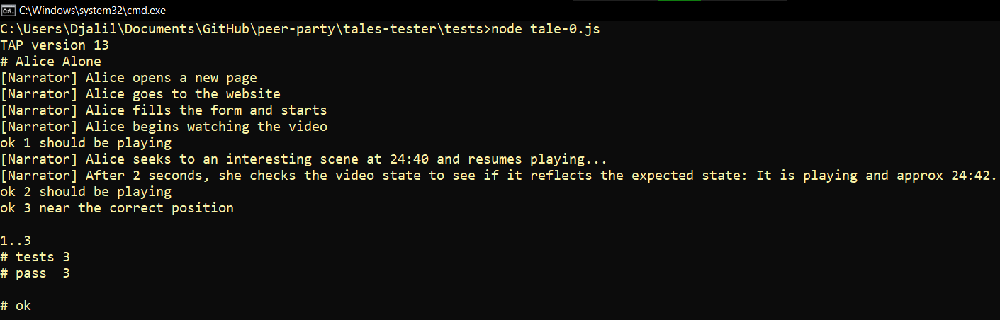

# Tales Tester

## Test files

_Charade_ (1953).

Check Ramblings for details.

## Tales

### Tale 0: Alice Alone.

<q class="blunderland narrator">It was one of those dull, drab, depressing days when somehow or other it seemed as if there wasn't anything anywhere for anybody to do.</q>
So Alice decided to watch a movie, alone.

- Alice visits the website and creates a session.
- Tests basic interactions with the video player (mostly using keyboard shortcuts, like Space).

### Tale 1: Toxic Alice.

(WIP)

Tests basic messaging functionality.
Basic syncing.
Different files.

### Tale 3: Alice, Bob, and Carol.

(TODO)

- Tests synching of state between multiple agents.
- Tests advanced messaging features: Typing, presence indicator, etc.

## Uses

Uses or may use

- `Promise.withResolvers`
    * Polyfill: https://github.com/zloirock/core-js#promisewithresolvers
    * https://github.com/tc39/proposal-promise-with-resolvers

- Testing frameworks: 
    * Tape https://github.com/ljharb/tape
        + KAITO: My fave, ig.
        + AFAIK, Tape, Mocha, and Jest (can) produce TAP.
    * node-tap (`npm:tap`)
    * Mocha https://mochajs.org/
    * Jest
    * Jasmine https://jasmine.github.io/
    * Playwright Test

[gutenberg-blunderland]: https://www.gutenberg.org/ebooks/28069 "Alice in Blunderland: An Iridescent Dream by John Kendrick Bangs | Project Gutenberg"
